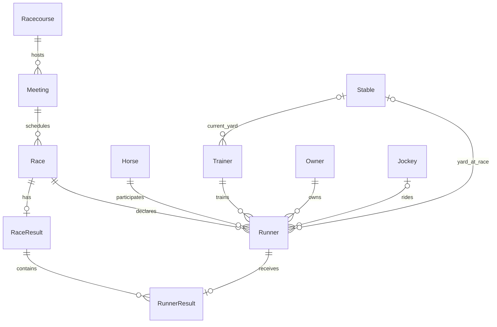

# Domain model and dictionary

Reviewed: 5 October 2026. This document describes the implemented domain foundation and explicitly identifies remaining design work. Physical columns and constraints are in the [data dictionary](DATA-DICTIONARY.md); consulted sources are in [source links](SOURCE-LINKS.md). The [feature backlog](FEATURES.md) describes delivery of ingestion and browsing separately.

## Review findings

The original scaffold contained only Racecourse, Horse, Race, and Runner. Races existed, but had no meeting, race code, surface, distance, or results. Trainers, stables, owners, jockeys, declaration status, and result outcomes were absent. The revised foundation contains eleven entities. It is not a complete implementation of the BHA rulebook or every field exposed by a racing source.

## Entity dictionary

| Entity | Meaning and identity | Relationships and boundary |
| --- | --- | --- |
| Racecourse | Physical racing venue; internal UUID, name and country | One course has many meetings. Track layouts and individual surfaces are future reference data. |
| Meeting | One fixture/session on a local calendar date at a racecourse; also called a meet | Belongs to one course; groups many races. Separate aggregate from Race. A multi-day festival spans multiple meetings; it is not one race. Names/date are searchable attributes, not identity. |
| Race | One contest in a meeting, with number, scheduled UTC start, code, surface, distance and going | Belongs to one meeting. Aggregate root for runners and one current result. Race number is unique within a meeting. Course is reached through Meeting, avoiding two conflicting course references. |
| Horse | A horse independent of any particular race; name, exact foaling date and country | Has many runners across races. Current trainer/owner are not placed on Horse because they must not rewrite historical race connections. |
| Stable | A training yard/location, separate from the trainer | May be referenced by many trainers and historical runners. A stable is not an owner or an individual stable employee. Names are not unique identities. |
| Trainer | Named trainer or source-listed training partnership | Optional current stable, optional licence reference and country. Many runners reference a trainer. Detailed licence history and partnership membership are future work. |
| Jockey | Rider identity, optional licence reference and country | Optional rider on each declaration, allowing an unconfirmed booking. One jockey has many rides over time. |
| Owner | The racing ownership identity shown for a runner | Individual, partnership, syndicate, company or racing club; one ownership identity may represent many people. Members and shares are future work. |
| Runner | A declared horse in a race, whether it eventually starts or becomes a non-runner | Belongs to Race and Horse; captures trainer, owner, optional jockey and optional stable for that race. Cloth and draw are distinct. This is not a pre-declaration entry. |
| RaceResult | Current provisional or official result publication for a race | Zero or one per race; contains runner outcomes and optional winning duration. Future revision history must preserve previous publications. |
| RunnerResult | One starter's outcome in the current race result | References both Runner and RaceResult with matching RaceId enforced by composite foreign keys. Finish position is nullable for non-finishers. |

## Rules and lifecycle

- Dependencies remain inward; the domain has no EF Core or web dependencies.
- Meeting transitions: Scheduled → InProgress → Completed; Scheduled/InProgress may become Abandoned. Race transitions: Scheduled → Off → Finished, or Scheduled/Off → Abandoned. Historical result import may move a Scheduled race directly to Finished.
- Adding runners, assigning a rider and marking non-runners require the owning scheduled Race. Load the full aggregate through the race repository before changing it. Meeting status does not automatically mutate individual races; orchestration must coordinate partial abandonment.
- Race enforces unique horse, cloth number and supplied draw. Runner captures connection identifiers at declaration time; later changes to Trainer's current yard cannot change Runner.StableId.
- A provisional result is assembled before publication as official. It must include a winner and an outcome for every starter; non-runners have no RunnerResult. A finisher has a positive position; a non-finisher has no position. Shared positions require dead-heat flags on all tied runners, and a dead heat requires at least two finishers.
- Official results cannot be edited in place through this API. Amendments, void-race publication and retrospective disqualification require the future revision workflow. `Void` is an available runner outcome, not a completed race-level void workflow.
- Domain methods enforce publication completeness and lifecycle. SQL enforces keys, same-race result references, uniqueness and row-level checks; direct SQL writes do not enforce every aggregate rule.

## Measurement and missing-data decisions

Meeting dates use the racecourse's local date (Europe/London for current British scope). Scheduled and publication timestamps are normalised to UTC. Distances are integer metres, carried weight is pounds, beaten distance is lengths, and winning time is a duration. Odds are decimal total-return odds greater than one; fractional quotes must be converted by ingestion. Prize money is GBP in this British scope; multi-currency data needs an explicit currency extension.

Null means unavailable/not applicable, not zero. Jockey, stable, draw, weight, odds, margins, duration and prize money can be absent. Trainer/owner IDs are required on a domain declaration: incomplete Created records should wait for projection rather than fabricate an identity. Public sources need not expose a licence, so trainer/jockey licence numbers are optional and never the sole ingestion key. Country qualifies licence uniqueness. Horse currently requires an exact foaling date; a source that supplies only age/year needs the planned partial-date extension before projection.

## Coverage still to design and implement

| Area | Additional entities/value objects and requirements |
| --- | --- |
| Entries before declaration | RaceEntry, entry/confirmation/withdrawal stages and timestamps, supplementary entries, elimination and reserve handling; separate from Runner. |
| Race conditions | Class/grade, handicap flag, rating and age/sex eligibility, purse, prize allocation, distance in source units, obstacle count, rail changes and race divisions. |
| Horse detail | Sex, colour, breeding country semantics, partial foaling dates, sire/dam pedigree, breeder and effective-dated ratings. |
| Connection history | HorseTrainingAssignment, HorseOwnership, TrainerStableAssignment with effective dates; ownership members/shares, partnership membership and licence jurisdiction/history. A single current stable reference does not describe every yard a trainer operates. |
| Declarations | Jockey substitution history, claim/allowances, penalties, equipment/headgear, ratings at race time and reserve activation. |
| Results and stewardship | ResultRevision, original/revised placing, stewards' decisions, disqualification/appeal history, void/walkover cases, margins in original text and sectional timing. |
| Conditions | Track configuration, surface subtype, going/weather observations with timestamps; going belongs to the race/observation, not permanently to a racecourse. |
| Source and processing identity | SourceEntityReference mapping provider/type/external ID to internal UUID, projection checkpoint and audit links. Never match a horse/person solely on name. |
| Markets and predictions | Timestamped OddsObservation, market/provider; PredictionRun/Prediction linked to race or runner and model/input versions. Keep these separate from official racing results. |

These are recorded gaps, not implemented tables. Source discovery determines which facts can actually be populated. There is no verified scrape-field inventory yet.

## Fit with Raw and Created layers

Raw payloads, collection runs, promotion runs and Curated records are pipeline concepts, not these domain aggregates. Curated records retain stable source identity, source URL, Raw lineage, FirstObserved and LastObserved; a future projection job will resolve internal identities and enforce domain rules. Do not add observation timestamps to racing facts as a substitute for ingestion lineage.

The implemented historical result slice remains in Curated: BHA meetings, races and
runner results are generic source objects, while normalized course location and
race-hour weather are Curated enrichments. Weather is intentionally not added to the
domain `RaceResult`; it describes environmental context at a time/location and keeps its
own Open-Meteo lineage. Domain projection and official result revision history remain
separate future work.

## Implementation order

1. Verify the eleven-entity foundation and schema; complete source discovery and identity rules.
2. Build reference-data ingestion and Created read slices, preserving unknown values.
3. Extend race conditions, horse facts and entries from observed source requirements.
4. Add result revisions and connection histories before importing corrections/history at scale.
5. Implement audited projection, then explore market/prediction data once coverage supports it.
